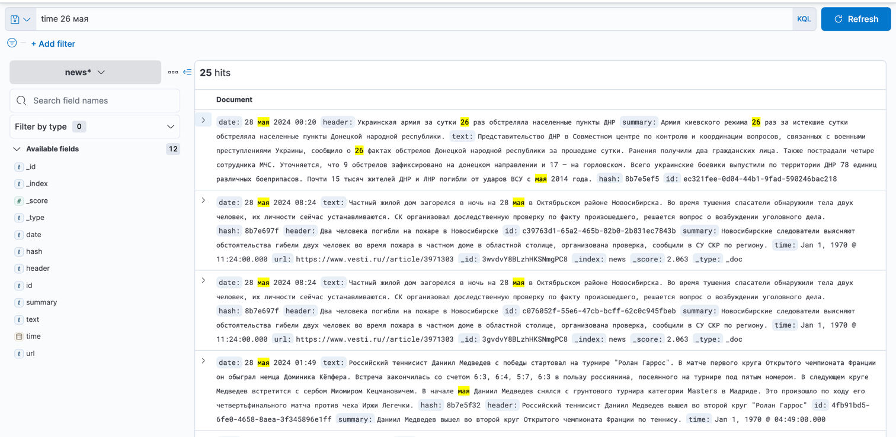
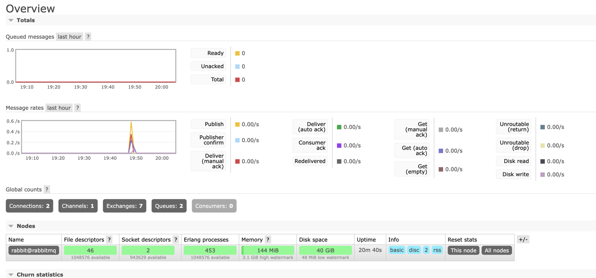

# Java Web Crawler

## Stack

- Elasticsearch 7.17.19 (библиотека v8.8.0)
- Kibana 7.17.19
- Java 21
- Jsoup 1.10.2 (lib)
- RabbitMQ 5.20.0 (lib)

### Run enviroment in docker
```
docker-compose -f docker/docker-compose.yml up -d
```

### Stop 
```
docker-compose -f docker/docker-compose.yml down
```
### ElasticSearch


### RabbitMQ


### О программе
Происходит парсинг сайта https://www.vesti.ru, для парсинга написаны 3 сервиса:
- LinkExtractor извлекает ссылки на новостные страницы из главной страницы, складывает их в rmq канал для ссылок
- NewsParser (сделал 2 инстанса) получает ссылки из этого канала (basic consume + ack), скачивает и парсит новостные страницы, затем кладет в rmq канал для распарсенных страниц
- NewsLoader (сделал 2 инстанса) слушает канал и получает из него через basic_get, затем сохраняет по индексу в elastic_search

BasicConsume является как правило лучшим решением: не испульзуется поллинг, поддержка долговременного соедения, когда консюмеру поступает много сообщений является более быстрым решением так как может за раз отдавать не одно, а множество сообщений 

То есть BasicConsume лучше подходит когда нужна высокая производительность

BasicGet работает по логике поллинга, постоянно опрашивая rmq, в таком сценарии использования basicGet получает либо сообщение из rmq, либо ничего
К его плюсам можно отнести простоту использования и лучший контроль над потреблением сообщений (каждый раз запрашивая одно сообщение и проверяя вернулось ли оно)

Все распаршенные новости сохраняются в elasticSearch по индексу со следующей структурой:

```
elasticClient.indices().create(c -> c.index(indexName).mappings(m -> m
        .properties("id", p -> p.text(d -> d.fielddata(true)))
        .properties("header", p -> p.text(d -> d.fielddata(true)))
        .properties("text", p -> p.text(d -> d.fielddata(true)))
        .properties("summary", p -> p.text(d -> d.fielddata(true)))
        .properties("URL", p -> p.text(d -> d.fielddata(true)))
        .properties("date", p -> p.text(d -> d.fielddata(true)))
        .properties("time", p -> p.date(d -> d.format("HH:mm")))
        .properties("hash", p -> p.text(d -> d.fielddata(true)))
));
```

Появление логов (добавление данных в файл) фиксируется сервисом filebeat, который отправляет их в logstash, далее логи пишутся в elactic по индексам вида: logstash-2024.05.27-000001

# Queries and Aggregations
### 1. OR Query
```
POST /news/_search
{
  "query": {
    "bool": {
      "should": [
        {"match": {"date": "26 мая"}},
        {"match": {"text": "Беспилотник"}}
       ]
    }
  }
}
```

### 2. AND Query
```
POST /news/_search
{
  "query": {
    "bool": {
      "must": [
        {"match": {"date": "26 мая"}},
        {"match": {"text": "Беспилотник"}}
       ]
    }
  }
}
```

### Script Query
```
POST /news/_search
{
  "query": {
    "script_score": {
      "query": {"match_all": {}},
      "script": {
        "source": "return doc['header'].value.length() "
      }
    }
  }
}
```

```
POST /news/_search
   {
     "query": {
       "bool": {
         "filter": {
           "script": {
             "script": {
               "source": "doc['summary'].value.length() < params.len",
               "params": {
                 "len": 2
               }
             }
           }
         }
       }
     }
   }
```

### MultiGet Query
```
GET /news/_mget
{
  "docs": [
    { "_id": "0a-vuI8BC13wuGT_9hhj" },
    { "_id": "v6-vuI8BC13wuGT_7RgF" }
  ]
}
```

### Histogram Aggregation
```
POST /news/_search
{
  "aggs": {
    "header_length_histogram": {
      "histogram": {
        "script": {
          "source": "doc['header'].value.length()",
          "lang": "painless"
        },
        "interval": 1
      }
    }
  }
}
```

### Terms Aggregation
```
POST /news/_search
{
  "aggs": {
    "dates": {
      "terms": {
        "field": "date"
      }
    }
  }
}
```

### Filter Aggregation
```
POST /news/_search
{
  "aggs": {
    "filtered_body": {
      "filter": {
        "term": {"author": "Ольга Тарасова"}
      },
      "aggs": {
        "avg_summary_length": {
          "avg": {
            "script": {
              "source": "doc['url'].value.length()",
              "lang": "painless"
            }
          }
        }
      }
    }
  }
}
```

